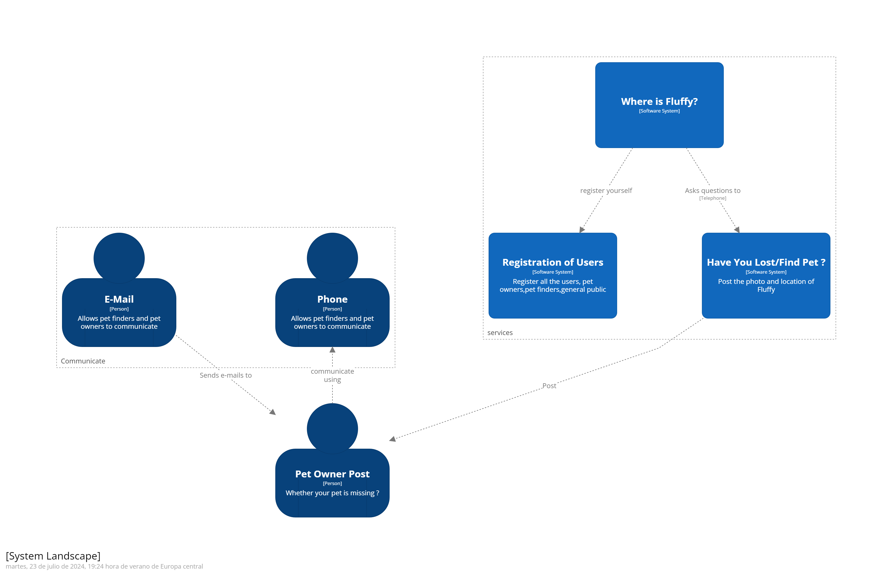

ifndef::imagesdir[:imagesdir: ../images]

[[section-building-block-view]]

== Building Block View

=== Whitebox Overall System

_**<Overview Diagram>**_

The Building Block View provides a static decomposition of the "Where's Fluffy?" system into its fundamental building blocks, detailing modules, components, subsystems, tiers, operations, and their interdependencies. This view acts like the floor plan of a house, providing a clear and organized structure.

Motivation::

The Building Block View helps maintain an overview of the source code by abstracting its structure. This allows for effective communication with stakeholders without delving into implementation details, making the system's architecture more accessible and comprehensible.

==== Level 1: System Context

Contained Building Blocks::
This is the main system that users interact with for posting and finding lost pets.

Important Interfaces::
- User Interface (Web and Mobile): Facilitates interaction between the users and the system. Ensures that users can register, log in, view pets, and communicate effectively.
- API Gateway: Acts as an entry point for all API requests, ensuring secure and efficient communication between clients and the backend services.
- Database Interface (MongoDB): Manages data storage and retrieval for user information, pet data, and transaction records. Ensures data integrity and security.

=== Level 2: Main Components (Blue Box)

The decomposition of the "Where's Fluffy?" system into its main components ensures clarity and manageability. By breaking down the system into distinct modules, each with a specific responsibility, we can facilitate development, maintenance, and scalability. This approach allows each component to be developed and tested independently, promoting modularity and reusability.

Contained Building Blocks

[options="header",cols="1,2,1"]
|===
|Building Block | Description|Interface(s)
|_User Management Module_|Handles user registration, authentication, and profile management|Web Interface, API
|_Pet Management Module_|Manages pet data, including adding, updating, and viewing missing pets|Web Interface, Mobile Interface, API
|_Communication Module_|Facilitates communication between pet finders and pet owners|Email, Phone
|_Reward Management Module_|Manages rewards for found pets, including reward postings and transactions|Web Interface, API
|_Scalability and Performance Module_|Ensures the system can handle increasing loads and maintain performance|Load Balancer, Database, Caching Service
|_Mobile Accessibility Module_|Ensures the service is accessible on mobile devices|Mobile Framework, API Gateway
|_MongoDB Database_|Stores user, pet, and transaction data|Database Interface
|===

=== Detailed Blue Box Descriptions

==== User Management Module

- **Purpose/Responsibility**: Handles user registration, authentication, and profile management.
- **Interface(s)**: Web Interface, API
- **(Optional) Quality/Performance Characteristics**: High reliability, secure user data
- **(Optional) Fulfilled Requirements**: User Registration, User Authentication
- **(Optional) Open Issues/Problems/Risks**: None identified

==== Pet Management Module

- **Purpose/Responsibility**: Manages pet data, including adding, updating, and viewing missing pets.
- **Interface(s)**: Web Interface, Mobile Interface, API
- **(Optional) Quality/Performance Characteristics**: High reliability, efficient data handling
- **(Optional) Fulfilled Requirements**: Pet Listing, Photo Proof
- **(Optional) Open Issues/Problems/Risks**: None identified

==== Communication Module

- **Purpose/Responsibility**: Facilitates communication between pet finders and pet owners.
- **Interface(s)**: Email, Phone
- **(Optional) Quality/Performance Characteristics**: High availability, secure communication
- **(Optional) Fulfilled Requirements**: User Communication
- **(Optional) Open Issues/Problems/Risks**: None identified

==== MongoDB Database

- **Purpose/Responsibility**: Stores user, pet, and transaction data.
- **Interface(s)**: Database Interface
- **(Optional) Quality/Performance Characteristics**: High availability, scalability, flexible schema design
- **(Optional) Fulfilled Requirements**: Data Storage, Data Retrieval
- **(Optional) Open Issues/Problems/Risks**: Data consistency, Backup and recovery processes

=== Level 3: Detailed White Box Descriptions

==== Registration Service

- **Purpose/Responsibility**: Handles new user registrations.
- **Interface(s)**: Web Interface, API
- **(Optional) Quality/Performance Characteristics**: High reliability, quick response time
- **(Optional) Fulfilled Requirements**: User Registration

==== Authentication Service

- **Purpose/Responsibility**: Manages user logins and authentication tokens.
- **Interface(s)**: Web Interface, API
- **(Optional) Quality/Performance Characteristics**: High security, quick response time
- **(Optional) Fulfilled Requirements**: User Authentication

==== Pet Registration Service

- **Purpose/Responsibility**: Allows users to register a missing pet.
- **Interface(s)**: Web Interface, API
- **(Optional) Quality/Performance Characteristics**: Secure photo upload, fast data processing
- **(Optional) Fulfilled Requirements**: Pet Listing, Photo Proof

==== Messaging Service

- **Purpose/Responsibility**: Manages messages between pet finders and pet owners.
- **Interface(s)**: Email, API
- **(Optional) Quality/Performance Characteristics**: High reliability, secure communication
- **(Optional) Fulfilled Requirements**: User Communication
